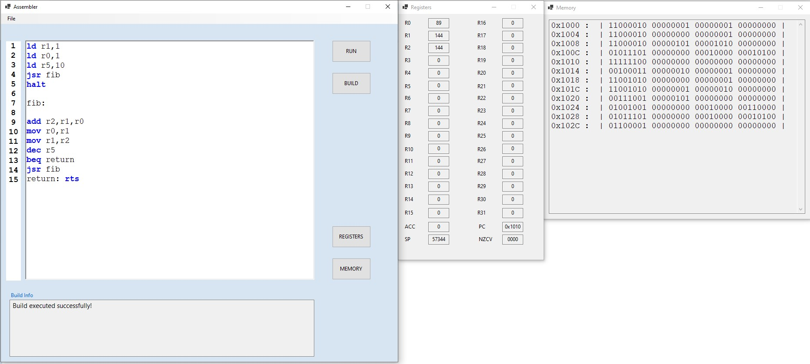

# Custom Assembler Emulator

 

Custom RISC Assembler Emulator with numerous functionalities.

 

# Overview 

A RISC Based Assembler Emulator. 
 
Instruction set contains 29 different instructions divided into 4 categories.
Instruction categories are as follows: 

1. Arithmetic Instructions (ADD, SUB, MUL, DIV, MOD, INC, DEC)
2. Logic Instructions (AND, OR, XOR, LSH, RSH, CMP)
3. Transfer And Registers Instruction (LD, ST, MOV, CLR)
4. Branch and Jump Instructions (JUMP, BEQ, BLSS, BGT, BGE, BLEQ, BNEQ, JSR, RTS)
5. Stack Instructions (PUSH, POP)
6. HALT instruction (HALT)

There are 4 types of instructions:

1. Zero Operands   -   Instructions operate with Accumulator, result is stored into Accumulator
2. One Operands    -   Instructions operate with one register, result is stored into that one register
3. Two Operands    -   Instructions operate with two register, result is stored into first register
4. Three Operands  -   Instructions operate with three register, result is stored into first register

 

# Instruction format

All instructions are aligned to 4 bytes (32bit). 

 

Instruction Format:  

    < INSTRUCTION NAME >  < OPERAND1 [opt] > ,   < OPERAND2 [opt] > ,  < OPERAND3 [opt] >

Branch and Jump Instructions Format:  

    < INSTRUCTION NAME > < LABEL >

Instruction Format in Binary:  

    | < [OP_CODE(6bit)] [TYPE(2bit)] > | < FIRST OPERAND > | < SECOND OPERAND > | < THIRD OPERAND > |

  
  
  Branch and Jump Instructions Format in Binary: 
  
    | < [OP_CODE(6bit)] [00] >  | < PADDING TO 32 BITS > | < LABEL ADDRESS > |

   
   
First byte of the instruction contains the OPCODE for the instruction (higher 6 bits) and type of instrcution (lower 2 bits). 
Depending on the type of the instruction the rest of the bytes are used for operands.  
Branch and Jump instructions store the label address begenign from the lowest bit( rightmost bit) 
 
  
# Configuration of Emulator System
 

Emulated System has:

1. 32 General Purpose Registers R0 - R31 (32bit Registers)   
2. Accumulator Register
3. PC Register
4. SP Register
5. NZCV Register
6. Memory View
7. Register View
8. Build Option
9. Run Option
10. User Stack
11. System Stack
12. 262144 KB of RAM
13. 262144 KB of ROM
 

# Memory Layout

Instructions are stored Into RAM begining from 0x1000 (PC). All instructions are aligned to 4 bytes. Every Instruction has Side Effect of incrementing PC by 4. Memory can only be accessed via Load (LD) and Store (ST) instructions. 
RAM is divided into several regions. 
First region is System Stack.  System Stack is only used when Jumping to Subroutines (JSR instruction - See Branch and Jump Instructions). This allows nested and recursive subroutine cals, because PC and NZCV registers are stored onto this stack. 
Second region is User Stack. User Stack can be accesd via PUSH and POP instrcutions, hence it's User Stack because user can alter Stack. 
Both Stacks grow towards higher addresses.  
Third region is the rest of the RAM. It is multifuncional region. 
There is also ROM. 

# Arithmetic Instructions

  Aritihmetic Instructions can be of all four types (Zero, One, Two, Three Address), except INC and DEC (Zero and One Address). 
  Arithmetic Instructions are as follows:
  1. Addition - ADD
  2. Subtraction - SUB
  3. Multiplication - MUL
  4. Division - DIV
  5. Modulo - MOD
  6. Increse By One - INC
  7. Decrese By One - DEC

  All Arithmetic Instructions Operation Codes start with three leftmost bits being 001, rest of the bits are indicators.  
  
  OP CODES:
      
      ADD <-> 001000
      SUB <-> 001001
      MUL <-> 001010
      DIV <-> 001011
      MOD <-> 001100
      INC <-> 001101
      DEC <-> 001110

  All Arithmetic Instructions can affect NZCV Register.  
  
  # Logic Instructions
  
  Logic Instructions can be of all four types (Zero, One, Two, Three Address), except CMP (One and Two Address).  
  Logic Instructions are as follows:                                                                            
  1. Bitwise And - AND
  2. Bitwise Or - OR
  3. Bitwise Exclusive Or - XOR
  4. Logic Left Shift - LSH
  5. Arithmetic Right Shift - RSH
  6. Compare - CMP
  
  All Logic Instructions Operation Codes start with three leftmost bits being 000, rest of the bits are indicators.  
  
  
  OP CODES:
  
      AND <-> 000001
      OR  <-> 000010
      XOR <-> 000011
      CMP <-> 000100
      LSH <-> 000101
      RSH <-> 000110
  
  All Logic Instructions can affect NZCV Register.  
  CMP Instruction ONLY affects NZCV Register.  
  
  # Jump And Branch Instructions
  
  
  Jump and Branch Instructions have purpose to jump to certain address given by a Label.  
  Jump and Branch Instructions only change the PC value by writing in it the address of a Label in the Instruction.  
  Jump Instrcution is unconditional Jump Instruction.  
  Branch Instrctuons must satisfy certain condition before branching to the Label.  
  Jump to Subroutine (JSR) Instruction jumps to Addres giben by a Label in a Instruction and saves NZCV and PC Registers to System Stack.  
  Return from Subroutine (RTS) Instruction returns to the Next Instruction after the JSR Instruction call. RTS pops from System Stack NZCV and PC Registers.  
  
  Jump And Branch Instructions are as follows: 
  
  1. JUMP - Unconditional Jump
  2. BEQ  - Branch if Equal (ZF == 1)
  3. BLSS - Branch if Less (CF == 1 ^ NF == 1)
  4. BGT  - Branch if Greater ( (NF == 1 ^ VF == 1) | ZF == 1 )
  5. BGE  - Branch if Greater or Equal (NF == 1 ^ VF == 1)
  6. BLEQ - Branch if Less or Equal ( !((NF == 1 ^ VF == 1) | ZF == 1) )
  7. BNEQ - Branch if Not Equal (ZF == 0)
  8. JSR  - Jump To Subroutine
  9. RTS  - Return From Subroutine
  
   
  
  Jump And Branch Instructions containt only OP CODE and Label address wich is stored starting from the leftmost bit in the Instrctuion Word.  
  All of the Jump And Branch Instructions begin with first two rightmost bits being 01, rest of the bits are indicators.
   
  
  
  OP CODES:
      
      JUMP  <-> 010000
      BEQ   <-> 010001
      BLSS  <-> 010010
      BGT   <-> 010011
      BGE   <-> 010100
      BLEQ  <-> 010101
      BNEQ  <-> 010110
      JSR   <-> 010111
      RTS   <-> 011000
  
  
  
  
  # Transfer And Register Instructions
  
  
 Transfer And Register Instructions can be divided into two categories.  First category are the Instructions that can operate with memory( LD, ST) and Second Category are the Instructions that operate directly with General Purpose Registers and Accumulator (LD immidiet, MOV, CLR ).  
 Instructions from this Category start with three leftmost bits beeing 110, the remaining bits are the indicators.  
 
 Load Instruction
 -----------------------
  
  Mnemonic for this Instruction is LD. 
  There are two formats of Load Instruction. The First is the format wher you can load immidet value into specified 
  Register or Accumulator(depending on the Type of instruction). 
  The Second is the format where you can load value from the memory into specified register. The Memory Address is
  located in second Register specified in instruction
    
   OP CODE:
   
    LD <-> 110000

 Store Instruction
 -----------------------
 
  Mnemonic for this Instruction is ST. 
  Store Instruction is used for storing Register values specified in first operand into memory location which address is stored in second register. Instruction can store Accumulator value if you only use one operand, then the address is in that specified Register.
  
    
   OP CODE:
   
    ST <-> 110001
  
 Move Instruction
 -----------------------
 
 Mnemonic for this Instruction is MOV.
 Move Instruction moves value from the Register specified in second operadn to Register specified in first operand. Insturction can move a value into Accumulator if it only has one operand.
 
   OP CODE:
   
    MOV <-> 110010
  
 Clear Instruction
 -----------------------
 
 Mnemonic for this Instruction is CLR.
 Clear Instruction clears Register, ie. it sets specified Reigster to 0. Instruction can clear Accumulator if it does not have any operands (Zero Address).
 
   OP CODE:
   
    CLR <-> 110011
  
  
  # Stack Instructions
  
  Stack Instructions have purpose of accessing User Stack (See Memory Layout).  
  Stack Instructions can be either One Addres or Zero Address. One Addres Type have one operand that specifies wich Register is used. Zero Addres Type does not have any operands specified, rather it uses Accumulator as designated Operand.  
  Stack Instructions are as follows :
  
  1. POP  - Pops value from the top of the User Stack
  2. PUSH - Pushes value to the top of the User Stack

  Stack Instructions have side effects of increasing/decresing value of SP register.  
  All Stack Instructions Operation Codes start with three leftmost bits being 100, rest of the bits are indicators.  

  OP CODES:
    
      POP   <->  100000
      PUSH  <->  100001

  
  # HALT instrcution
  
  HALT instruction has purpose to halt (stops) the program.  
  HALT instruction is necessary to every program. Without it program won't finish executing.  
  HALT instruction does not have any operands  
  
  OP CODE:
      
      HALT  <-> 111111
    
  
  
  
  
